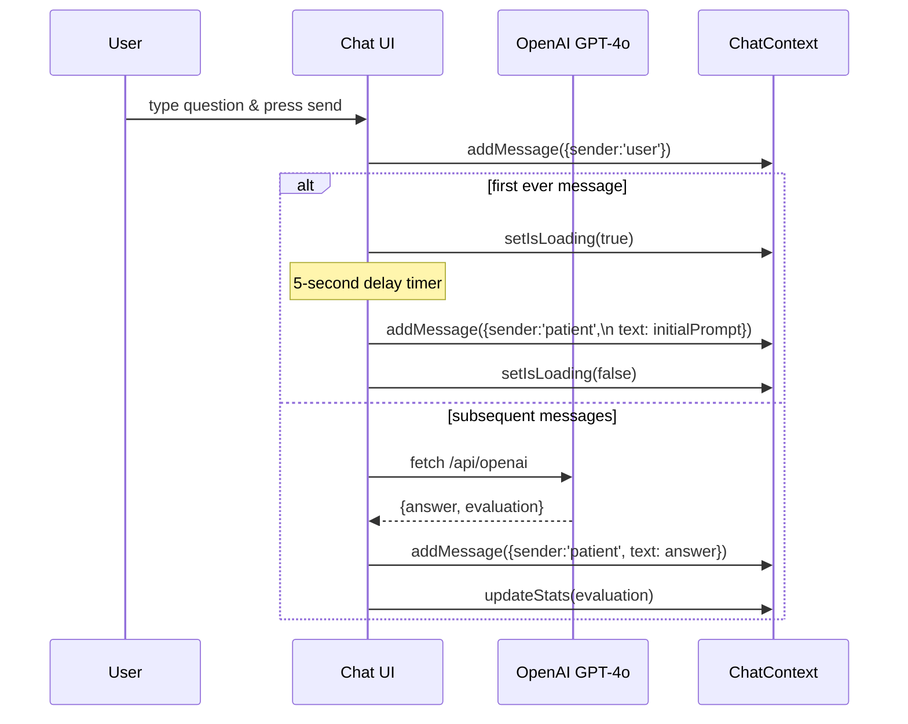

# PocketPatient – Technical Walk-Through & Pitch Guide

> **Audience:** product managers, technical leads, and investors who have some familiarity with modern web stacks but don’t necessarily read TypeScript every day.
>
> **Goal:** give you a deep, end-to-end understanding of how PocketPatient is built, what problems it solves, and how each moving part fits together, so that you can pitch, extend, or onboard new contributors with confidence.

---

## 1. High-Level Value Proposition

PocketPatient is a **web-based clinical training simulator**.  Students chat with life-like virtual patients, refine their differential diagnoses, and receive instant AI-generated feedback & scoring.  The platform lowers the cost of bedside exposure, scales faculty time, and standardises competency measurement.

Key differentiators:

| Feature                          | PocketPatient | Traditional Sim Labs | Generic ChatGPT |
|----------------------------------|---------------|----------------------|-----------------|
| Persona-locked, culturally aware | ✅            | ⚠ (actor dependent)  | ❌              |
| Real-time scoring                | ✅            | ❌                   | ❌              |
| Multi-modal (TTS)                | ✅            | ⚠ (needs hardware)   | ❌              |
| Progressive difficulty           | ✅            | ⚠                    | ❌              |
| Runs in any browser              | ✅            | ❌                   | ✅              |

---

## 2. Technology Stack

* **Next.js 15 (App Router / Turbopack)** – server-side rendering, routing, API routes.
* **TypeScript 5** – strict typing for safer refactors.
* **Tailwind CSS** – rapid, utility-first styling.
* **OpenAI SDK (Edge)** – GPT-4o chat & TTS endpoints.
* **React Context** – in-browser state persistence (chat transcript, scoring, session).
* **Session Storage** – lightweight client persistence (restores chat after refresh).
* **Vercel** – zero-config edge deployment (CI/CD ready).

Why this stack?

* Familiar to JS talent pool, low onboarding friction.
* Edge-functions & fetch make HIPAA-lite compliance easier (no back-end DB yet).
* Turbopack == fast local dev ( <2s cold start ).

---

## 3. Folder-by-Folder Tour

```
app/
│  ├─ (chat)/chat/         ← React page for live consultation
│  ├─ (main)/cases/        ← Case selection grid
│  ├─ evaluation/          ← Post-consult summary
│  └─ api/                 ← Next.js Route Handlers (openai.ts, tts.ts)
│
components/
│  ├─ chat/                ← UI atoms & modals (Messages, Input, Diagnosis…) 
│  ├─ charts/              ← Reusable chart wrappers (coming soon)
│  └─ TrendingMedicalNews  ← Example home-page widget
│
contexts/                  ← Global React providers (ChatContext.tsx)
constants/                 ← Static data (clinicalCases array)
lib/                       ← Browser helpers (openai.ts – thin fetch wrappers)
public/                    ← Static svg/img assets
styles/ or app/globals.css ← Tailwind base layer

GUIDE.md   ← you are here
README.md  ← project overview for devs
```

> **Convention:** `()` around a route segment (e.g. `(chat)`) in Next 15 groups pages without affecting the URL.

---

## 4. Data Model

### 4.1 `constants/cases.ts`

Each patient is a **Case** object:

```ts
interface Case {
  id: string;                  // slug e.g. "case-aling-nena"
  title: string;               // marketing name
  description: string;         // one-liner preview
  initialPrompt: string;       // first patient monologue
  patientInfo: { name: string; details: string; avatarText: string };
  difficulty: "Novice" | "Expert";
  time: string;                // recommended duration
  specialty: string;           // e.g. "Geriatrics"
  customData?: Record<string, unknown>; // bulk persona json (symptoms, culture…)
}
```

`clinicalCases` is a plain exported array – zero database until we need versioning.

### 4.2 `ChatContext` State Shape

```ts
interface Message { sender: "patient" | "user"; text: string; time: string; }
interface Stats   { points: number; cases: number; lives: number; }
interface Context {
  stats, messages, patient, notes,
  evaluations: ("good"|"bad"|"neutral")[],
  // methods…
}
```

Why Context instead of Redux/Zustand?  Simpler API + SSR-safe without hydration race.

---

## 5. User Flow Deep Dive

### 5.1 Case Selection

1. **Route** `/cases` lists `clinicalCases` via a `CaseCard` component.
2. On click, `selectCase(case)` is fired (ChatContext) →
   * stores the chosen case
   * resets timers & evaluation array
   * **does NOT** preload messages (after recent change).
3. Router pushes to `/chat` (App Router page).

### 5.2 Live Chat Page `(chat)/chat/page.tsx`

Key states:

* `messages` – array from context.
* `isLoading` – toggles spinner; set when waiting for AI.
* modal toggles – note taking, diagnosis submission.



#### 5.2.1 First Message Shortcut

*Added in commit `20c2810`:*

```ts
if (messages.length === 0) {
  setIsLoading(true);
  setTimeout(() => addMessage(patientReply), 5000);
  return; // Skip OpenAI
}
```

Why?  Demo latency – gives illusion of real typing without incurring token cost.

### 5.3 Serverless API – `pages/api/openai.ts`

Runs **only** server-side (Node, not edge yet).

---

#### 5.3.1 Prompt Anatomy – How Each Message Becomes a GPT Call

1. **System Prompt** – built by `getSystemPrompt(history, patient)`
   * Injects the full patient persona (identity, culture, symptoms).
   * Appends the running **Conversation History** (`sender: text`) so GPT has context.
   * Locks the output schema: GPT must reply with `{ "answer": string, "evaluation": "good|neutral|bad" }`.
2. **User Prompt** – the latest user message (`text`) is sent as `userPrompt`.
3. **OpenAI Call** – `/api/openai` receives `{ userPrompt, systemPrompt }` and forwards to GPT-4o.
4. **Client Parse** – we JSON.parse the string; if malformed we fall back to raw text.

> Why split system/user?  It keeps sensitive persona data server-side; the browser only learns the final answer.

---

#### 6. Doctor Ground-Truth Pipeline (Backend-Only)

For real deployments we compare the student’s final diagnosis to a **doctor-authored ground truth**.

1. **Authoring Tool** (outside this repo) – clinicians fill out a form with:
   * Case ID (matches `clinicalCases.id`).
   * Canonical diagnosis, ICD-10 codes, rationale paragraphs.
   * Weighted rubric (JSON) for partial credit.
2. **Secure Upload Endpoint** – e.g. `/admin/api/cases/:id/groundtruth` (Node + Prisma)
   * Auth via JWT (role = `doctor`).
   * Stores JSON blob in Postgres `ground_truth` table.
3. **Comparison Service** – when `SubmitDiagnosisModal` hits `/api/evaluate` (future), server will:
   * Fetch ground truth.
   * Pass both **student diagnosis** and **ground truth** into GPT-4o with a grading rubric prompt.
   * Persist score & feedback.
4. **Evaluation Page** reads that stored JSON and renders charts.

> For the hack-friendly demo we mock this by asking GPT to self-grade (lines 60-75 of `SubmitDiagnosisModal.tsx`).  In production we will replace the mock rubric with this doctor-signed pipeline.


1. Validates `OPENAI_API_KEY`.
2. Accepts `{ userPrompt, systemPrompt }`.
3. Calls `openai.chat.completions.create` with `model:"gpt-4o"`.
4. Returns `{ text }` minimal JSON.

Advantages: exposes **one** internal endpoint; browser never sees API key.

### 5.4 Client Helper – `lib/openai.ts`

Abstracts away fetch boilerplate and adds graceful JSON/Blob handling for TTS.

```ts
export async function getOpenAIResponse(prompt, system?) { ... }
export async function getOpenAITTSUrl(text, voice?, model?, speed?) { ... }
```

---

## 6. Evaluation & Scoring

* **SubmitDiagnosisModal** → user writes final assessment.
* We craft a very detailed **rubric prompt** (lines 60-75) specifying JSON schema.
* OpenAI returns JSON which is parsed client-side & routed to `/evaluation`.
* Evaluation page currently renders an SVG mock; the real chart components live under `components/charts/`.
* `stats.points` & `lives` are updated depending on AI evaluation (`good/bad`).

Why client-side parse?  Faster iterations & avoids server CPU while we tune rubric.

---

## 7. Persistence & Session Recovery

* At every context update, we `sessionStorage.setItem("chatState", JSON)`.
* On mount, provider tries to `JSON.parse` and rehydrate.
* This means a browser refresh keeps chat & timers, but new tab starts fresh.
* Future roadmap: encrypt & sync with Supabase so progress follows login.

---

## 8. Accessibility & i18n

* Tailwind focuses heavily on contrast & mobile-first sizing.
* Dynamic text areas use semantic `<label>` tags.
* Language mixing (Tagalog/English) is baked into the persona so no `next-i18next` yet.

---

## 9. Deployment Story

* Build: `pnpm run build` → static + server bundles (~4 MB).
* Edge SSR not enabled yet; Node functions are ok on Vercel Hobbies.
* CI: GitHub Actions (coming) → Netlify/Vercel preview on PR.
* ENV: `.env.example` lists **OPENAI_API_KEY**; devs copy to `.env.local`.

---

## 10. Security Notes

* No PHI – all patient data is synthetic.
* API key kept server side; browser only hits our `/api/openai`.
* No database yet; when added we’ll use Row Level Security.
* **Future:** HIPAA BAA with OpenAI or switch to Azure OpenAI if required.

---

## 11. Performance & Cost Control

* Lazy AI – first message handled offline (5s delay) saves 1 API call per session.
* Turbopack dev server: <20 ms incremental rebuilds.
* Bundle analysed via `next build --profile` (101 kB shared JS on first load).
* Cheapest GPT-4o calls (~$0.01 per full chat) thanks to concise prompts.

---

## 12. Roadmap

1. **Edge Runtime** – Move API routes to `app/api` with streaming.
2. **Voice mode** – integrate Web Speech API for microphone input.
3. **Adaptive difficulty** – dynamic persona memory that evolves.
4. **Analytics dashboard** – teacher view with cohort heatmaps.
5. **LMS integration** – LTI 1.3 for Canvas & Moodle.

---

## 13. Pitch Takeaways

* **Scalable** – one codebase = infinite virtual patients.
* **Engaging** – chat UI, points & lives gamify learning.
* **Data-driven** – every question graded – objective competency metrics.
* **Low friction** – works on any device, no install, <5 MB total download.

> **Ask:** seeking $250k seed to fund content pipeline & institutional pilots (3 universities, 500 students).  Budget allocates 50% to clinician-writer stipends, 30% engineering, 20% compliance & hosting.

---

## 14. Data Collection & Safety

PocketPatient is currently a **client-side-only demo**.

* All transient state (chat transcript, notes, scores) is persisted in the browser’s **`sessionStorage`** only.  Nothing leaves the user’s device.
* There is **no server database** or cloud analytics pipeline at this stage.
* The sole network call is to `/api/openai`, which proxies to OpenAI and returns an anonymised response.  The request body contains only the conversation content and does **not** include any personally identifiable information (PII).
* Clearing the browser tab or invoking `clearChat()` wipes everything locally.

Once we integrate a backend (Postgres + Supabase) we will add an opt-in consent flow and update this section accordingly.

---

## 15. FAQ (Technical Edition)

| Question | Answer |
| --- | --- |
| *Why not WebSockets?* | HTTP long-polling via fetch is simpler; latency is dominated by GPT anyway.  We can upgrade to Server-Sent Events when streaming responses. |
| *Is GPT hallucination a risk?* | We mitigate via locked persona + rubric parse; evaluation JSON must validate or we fail-safe. |
| *Can this run offline?* | Core UI yes, AI no.  Plug in local LLM (Mistral 7B) via new API route and host on-prem.
| *Does Turbopack support Windows?* | Yes, as used during development; fallback to `next dev` if issues. |

---

